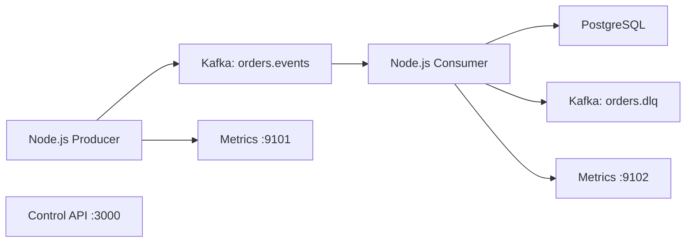

# Kafka Reliability & Event Streaming Platform

A hands-on Kafka-to-PostgreSQL reliability lab for reproducing, observing, and recovering from common event-streaming incidents.

The local pipeline and four core scenarios are implemented through Step 13. OpenTelemetry, Prometheus infrastructure, Grafana, and Kubernetes support are planned next.

## What This Project Demonstrates

- Kafka event production and database consumption.
- Increasing consumer lag and lag recovery.
- Broker failure detection and client recovery behavior.
- Duplicate-message protection with idempotent database writes.
- Poison-message validation and dead-letter topic routing.
- Prometheus-compatible application metrics.

## Architecture



## Incident Scenarios

| Scenario | Trigger | Expected Behavior | Guide |
| --- | --- | --- | --- |
| Increasing consumer lag | Fast Producer plus delayed Consumer | Lag grows, then drains after normal processing resumes | [Consumer lag](docs/consumer-lag.md) |
| Broker failure | Stop the Kafka container | Clients detect failure; Consumer reconnects after Kafka recovers | [Broker failure](docs/broker-failure.md) |
| Duplicate messages | `DUPLICATE_EVERY_N_MESSAGES=2` | Duplicate events are detected and skipped | [Duplicate messages](docs/duplicate-messages.md) |
| Poison message | `POISON_EVERY_N_MESSAGES=2` | Invalid records go to `orders.dlq`; valid records continue | [Poison message](docs/poison-message.md) |

## Technology

| Area | Technology |
| --- | --- |
| Runtime | Node.js 20+ |
| Streaming | Apache Kafka 3.7 in KRaft mode |
| Database | PostgreSQL 16 |
| Local environment | Docker Compose |
| Metrics | `prom-client` Prometheus endpoints |
| Planned platform | OpenTelemetry, Prometheus, Grafana, Kubernetes |

## Quick Start

Prerequisites: Docker Desktop and Node.js 20 or later.

```bash
npm install
docker compose up -d
./scripts/setup-topics.sh
```

Start the Consumer in one terminal:

```bash
npm run start -w apps/consumer
```

Start the Producer in another terminal:

```bash
npm run start -w apps/producer
```

Successful delivery produces these logs:

```text
Published order.created ...
Stored order.created ...
```

Inspect the database and application metrics:

```bash
npm run db:summary
curl http://localhost:9101/metrics
curl http://localhost:9102/metrics
```

Stop the Producer and Consumer with `Control+C`, then stop the dependencies:

```bash
docker compose down
```

For the complete three-terminal walkthrough, scenario validation, expected output, recovery steps, and troubleshooting, see the [Step-by-Step Testing Guide](docs/testing-guide.md).

## Services

| Service | Default Address | Purpose |
| --- | --- | --- |
| Kafka | `localhost:9092` | Main event stream and DLQ |
| PostgreSQL | `localhost:5432` | Durable idempotent event storage |
| Control API | `localhost:3000` | Health and scenario state endpoints |
| Producer metrics | `localhost:9101/metrics` | Publish counters, errors, and duration |
| Consumer metrics | `localhost:9102/metrics` | Consumption, duplicate, DLQ, and DB metrics |

## Repository Layout

```text
apps/                  Producer, Consumer, and Control API
docs/                  Testing guides, scenario runbooks, and project planning
infra/docker/          Kafka and PostgreSQL local configuration
infra/kubernetes/      Planned Kubernetes manifests
infra/observability/   Planned observability configuration
packages/shared/       Shared contracts and utilities
scripts/               Topic, database, and Kafka helper scripts
```

## Documentation

| Document | Purpose |
| --- | --- |
| [Project Plan and Status](docs/project-plan.md) | Delivery steps, approval rules, strategy, status, and verification history |
| [Step-by-Step Testing Guide](docs/testing-guide.md) | Full local walkthrough for all four scenarios |
| [End-to-End Test Results](docs/end-to-end-testing.md) | Recorded local integration results |
| [Local Dependencies](docs/local-dependencies.md) | Kafka and PostgreSQL setup |
| [Kafka Topics](docs/kafka-topics.md) | Topic creation and inspection |
| [Database Schema](docs/database-schema.md) | Event storage and idempotency constraints |
| [Metrics](docs/metrics.md) | Producer and Consumer metric reference |
| [Control API](docs/control-api.md) | Health and scenario endpoints |

## Known Limitation

After a long Kafka outage, the Consumer reconnects automatically, but the Producer can exhaust its KafkaJS retry budget. Restart the Producer after Kafka becomes healthy. Automatic Producer recovery is reserved for a separate reliability step.
