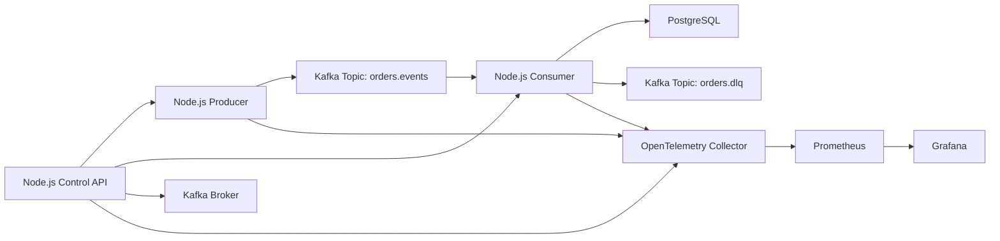

# Kafka Reliability & Event Streaming Platform

This project simulates a Kafka-to-database event streaming platform and turns common Kafka incidents into repeatable, observable exercises.

The goal is not to build everything at once. The project will be implemented in small steps. Each step must complete one feature or one goal, and every GitHub commit or pull request requires explicit approval before it is submitted.

## Project Goals

- Build a local Kafka-to-DB pipeline.
- Simulate and diagnose consumer lag growth.
- Simulate broker failure and observe service behavior.
- Simulate duplicate messages and implement idempotent database writes.
- Simulate poison messages and route failed records safely.
- Add observability with Prometheus, Grafana, and OpenTelemetry.
- Provide Kubernetes manifests after the local Docker workflow is stable.
- Keep each implementation step small, reviewable, and easy to roll back.

## Technology Stack

- Kafka for event streaming.
- Node.js for producer, consumer, and control API services.
- Database, initially PostgreSQL, for durable event storage.
- Docker Compose for the first local environment.
- Kubernetes for the deployable platform version.
- Prometheus for metrics collection.
- Grafana for dashboards.
- OpenTelemetry for traces and service instrumentation.

## High-Level Architecture



## Core Services

| Service | Purpose |
| --- | --- |
| Producer | Generates business events and publishes them to Kafka. |
| Consumer | Reads Kafka events, validates payloads, and writes records to the database. |
| Control API | Exposes scenario toggles such as slow consumer mode, duplicate publishing, poison message publishing, and health checks. |
| Database | Stores consumed events and supports idempotency checks. |
| Kafka | Provides the event streaming backbone. |
| Prometheus | Scrapes service, Kafka, and database metrics. |
| Grafana | Visualizes lag, throughput, failures, retries, and database writes. |
| OpenTelemetry Collector | Receives traces and metrics from Node.js services. |

## Incident Scenarios

### 1. Consumer Lag Keeps Increasing

The producer emits messages faster than the consumer can process them.

Expected learning goals:

- Understand consumer group lag.
- Compare producer rate, consumer throughput, and database write latency.
- Observe when lag grows, stabilizes, or drains.
- Practice scaling or tuning the consumer.

Possible controls:

- Increase producer event rate.
- Add artificial consumer processing delay.
- Add artificial database write delay.
- Reduce consumer concurrency.

Important signals:

- Kafka consumer group lag.
- Messages produced per second.
- Messages consumed per second.
- Database write latency.
- Consumer error rate.

### 2. Broker Failure

Kafka becomes temporarily unavailable or one broker is stopped.

Expected learning goals:

- Understand producer retry behavior.
- Understand consumer reconnect behavior.
- Observe message delivery recovery after broker availability returns.
- Distinguish service failure from dependency failure.

Possible controls:

- Stop the Kafka broker container.
- Restart the Kafka broker container.
- In Kubernetes, delete a broker pod and watch recovery.

Important signals:

- Producer publish failures.
- Consumer disconnects and reconnects.
- Kafka broker availability.
- Event throughput drop and recovery.
- Application health and readiness state.

### 3. Duplicate Messages

The same logical event is published or consumed more than once.

Expected learning goals:

- Understand at-least-once delivery.
- Use event IDs and database constraints for idempotency.
- Track duplicates without corrupting business state.

Possible controls:

- Publish the same event ID multiple times.
- Force a consumer retry after a successful database write but before offset commit.

Important signals:

- Duplicate event count.
- Database conflict count.
- Consumer retry count.
- Stored event count versus consumed message count.

### 4. Poison Message

A malformed or invalid message blocks normal processing unless it is handled safely.

Expected learning goals:

- Validate messages before database writes.
- Avoid infinite retry loops.
- Route invalid records to a dead-letter topic.
- Preserve enough context for later investigation.

Possible controls:

- Publish invalid JSON.
- Publish a valid JSON record with missing required fields.
- Publish a record that intentionally fails business validation.

Important signals:

- Validation failure count.
- Dead-letter topic message count.
- Consumer retry count.
- Consumer processing latency.

## Step-by-Step Delivery Plan

Each step should be small enough to review independently. A step is complete only when it has documentation, a verification command or checklist, and approval to commit.

| Step | Goal | Feature Scope | Expected Deliverable |
| --- | --- | --- | --- |
| 1 | Define architecture | README with goals, system design, scenarios, and delivery rules | `README.md` |
| 2 | Add local project skeleton | Minimal directories and package metadata only | Empty service folders, root package metadata, no runtime behavior |
| 3 | Start local dependencies | Docker Compose for Kafka and PostgreSQL | `docker-compose.yml` plus setup docs |
| 4 | Create Kafka topic setup | Repeatable topic creation for main and DLQ topics | Script or container command for `orders.events` and `orders.dlq` |
| 5 | Build producer MVP | Producer publishes valid events at a fixed rate | Node.js producer with basic logs |
| 6 | Build consumer MVP | Consumer reads events and writes to database | Node.js consumer with database insert |
| 7 | Add database schema | Durable event table with unique event ID | Migration or init SQL |
| 8 | Add control API | Basic endpoints for health and scenario toggles | Node.js API service |
| 9 | Simulate increasing lag | Producer rate or consumer delay control | Reproducible lag scenario |
| 10 | Add lag metrics | Expose consumer throughput and lag-related metrics | Prometheus metrics endpoint |
| 11 | Simulate broker failure | Documented broker stop/restart workflow | Runbook section and verification checklist |
| 12 | Handle duplicate messages | Idempotent database writes using event ID | Duplicate scenario and metrics |
| 13 | Handle poison messages | Validation plus dead-letter topic routing | DLQ flow and investigation docs |
| 14 | Add OpenTelemetry traces | Trace producer, consumer, API, and DB operations | OTel collector config and trace spans |
| 15 | Add Prometheus | Scrape Node.js services and infrastructure metrics | Prometheus config |
| 16 | Add Grafana dashboard | Dashboard for throughput, lag, errors, and DLQ | Grafana dashboard JSON |
| 17 | Add Kubernetes manifests | Deploy Kafka, DB, services, and observability components | Kubernetes YAML under `k8s/` |
| 18 | Add incident runbooks | Operator instructions for each failure mode | Docs for detect, diagnose, mitigate, recover |
| 19 | Add tests | Unit or integration tests for critical behavior | Tests for idempotency, validation, and health |
| 20 | Final review | Polish docs, verify all scenarios, prepare demo flow | Complete demo checklist |

## GitHub Approval Rule

No commit, branch push, pull request, or GitHub issue update should be performed automatically.

Workflow for every step:

1. Implement or document exactly one step.
2. Show the changed files and summarize the result.
3. Run the step's verification checklist where applicable.
4. Ask for approval before any Git commit.
5. Ask for approval again before any push or pull request.

## Initial Local Development Strategy

The recommended order is local-first:

1. Build the Docker Compose environment.
2. Prove Kafka-to-DB delivery locally.
3. Add incident toggles one at a time.
4. Add metrics and dashboards.
5. Move the stable version into Kubernetes.

This keeps early debugging fast and avoids mixing application behavior problems with Kubernetes deployment problems.

## Repository Layout

The repository starts as a small Node.js workspace. Runtime code will be added in later steps.

```text
docker-compose.yml  Root Compose entrypoint for local dependencies.
apps/
  producer/       Kafka event producer service.
  consumer/       Kafka-to-database consumer service.
  control-api/    Scenario control and health API.
packages/
  shared/         Shared event contracts and helper utilities.
infra/
  docker/         Docker Compose and local dependency configuration.
  kubernetes/     Kubernetes manifests.
  observability/  Prometheus, Grafana, and OpenTelemetry configuration.
docs/             Incident runbooks and verification notes.
scripts/          Local setup and maintenance scripts.
```

Step 2 verification:

- `git status --short` shows only skeleton files for review.
- `find . -maxdepth 3 -type f | sort` shows workspace metadata and placeholder files only.
- No application runtime code has been added.

Step 3 verification:

- `docker compose config` resolves the root Compose entrypoint.
- Kafka is configured as a local single-node broker on port `9092`.
- PostgreSQL is configured on port `5432` with database `event_stream`.

Step 4 verification:

- `sh -n scripts/setup-topics.sh` validates the topic setup script syntax.
- `docker compose config` confirms the Docker Compose service name used by the script.
- When Kafka is running, `./scripts/setup-topics.sh` creates `orders.events` and `orders.dlq` idempotently.

Step 5 verification:

- `npm run check -w apps/producer` validates producer JavaScript syntax.
- `npm run test` verifies workspace test scripts still resolve.
- When Kafka is running, `npm run start -w apps/producer` publishes normal `order.created` events to `orders.events`.

Step 6 verification:

- `npm run check -w apps/consumer` validates consumer JavaScript syntax.
- `npm run test` verifies workspace test scripts still resolve.
- `docker compose config` confirms the PostgreSQL init schema mount resolves correctly.
- When Kafka and PostgreSQL are running, the consumer stores normal `order.created` events in `consumed_events`.

Step 7 verification:

- `sh -n scripts/db-summary.sh` validates the database summary script syntax.
- `npm run db:summary` inspects the local database when PostgreSQL is running.
- `docker compose config` confirms the PostgreSQL init schema mount still resolves correctly.

Step 8 verification:

- `npm run check -w apps/control-api` validates Control API JavaScript syntax.
- `npm run test` verifies workspace test scripts still resolve.
- When running locally, `GET /health` returns service health and `GET /scenarios` returns scenario state.

Step 9 verification:

- `npm run check -w apps/consumer` validates the artificial processing delay control.
- `npm run check -w apps/producer` validates producer interval configuration.
- `docs/consumer-lag.md` documents how to create and recover increasing lag.

Step 10 verification:

- `npm run check -w apps/producer` validates producer metrics endpoint code.
- `npm run check -w apps/consumer` validates consumer metrics endpoint code.
- `docs/metrics.md` lists producer and consumer Prometheus metrics.

## Definitions

| Term | Meaning |
| --- | --- |
| Consumer lag | The difference between the latest Kafka offset and the offset processed by a consumer group. |
| Broker failure | Kafka broker unavailability caused by stopping, restarting, or deleting the broker instance. |
| Duplicate message | More than one Kafka message representing the same logical business event. |
| Poison message | A message that repeatedly fails processing because its payload or business meaning is invalid. |
| Dead-letter topic | A Kafka topic used to store messages that cannot be processed successfully. |
| Idempotency | The ability to process the same logical event more than once without changing the final result incorrectly. |

## Current Status

- Step 1 is complete.
- Step 2 is complete.
- Step 3 is complete.
- Step 4 is complete.
- Step 5 is complete.
- Step 6 is complete.
- Step 7 is complete.
- Step 8 is complete.
- Step 9 is complete.
- Step 10 is drafted and awaiting review.
- Producer and consumer expose Prometheus-format metrics endpoints.
- Step 10 has not been committed or pushed.
